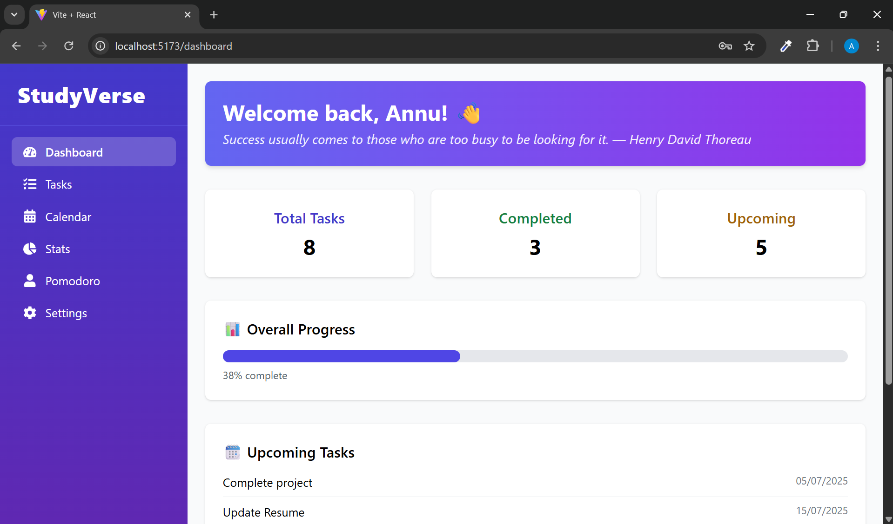
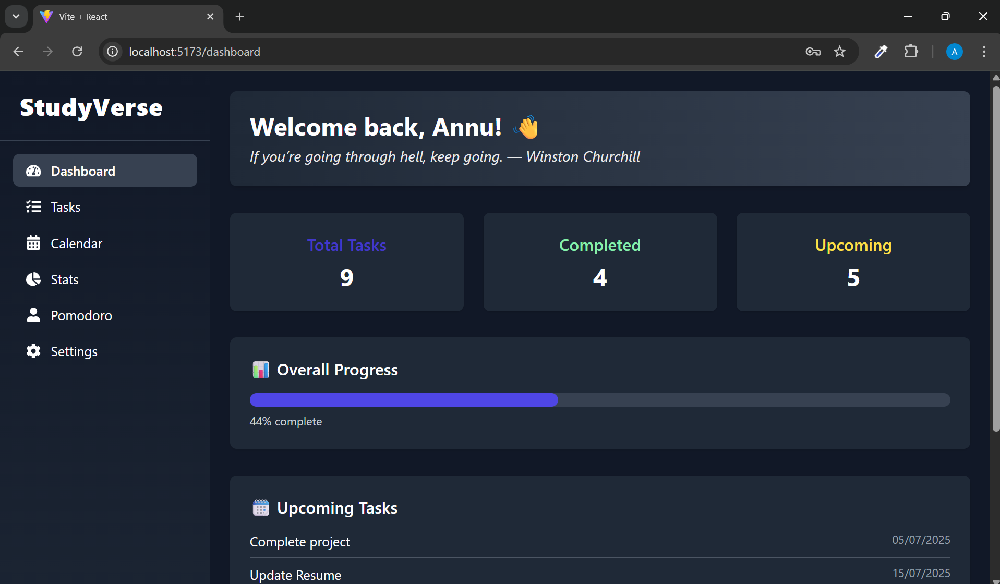
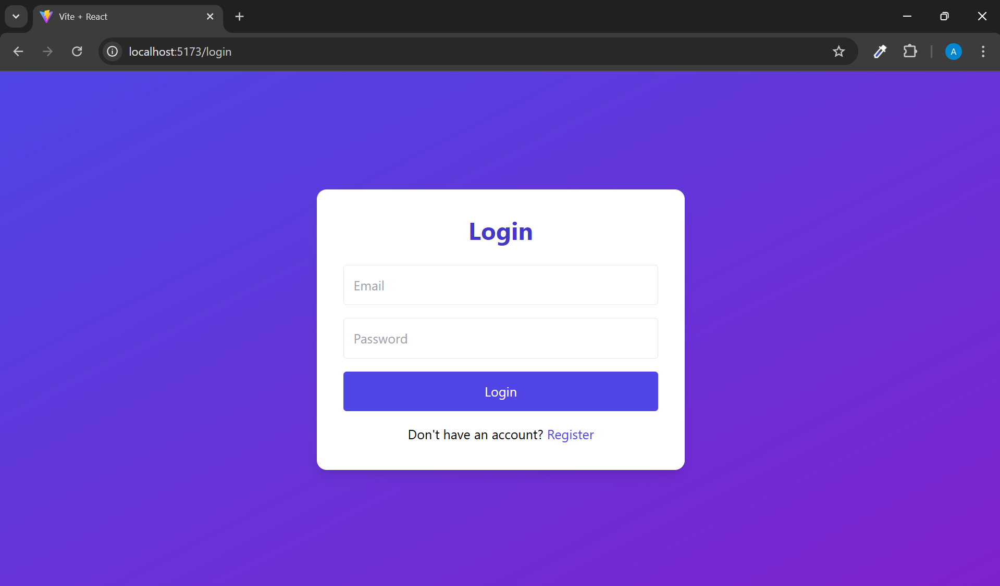

# StudyVerse – All-in-One Productivity Dashboard for Students

**StudyVerse** is a sleek, full-stack productivity dashboard built to support students and self-learners. It integrates essential tools like task management, calendar planning, pomodoro focus sessions, productivity analytics, and customizable themes — all in one responsive and intuitive platform.

---

## Features

- Task Manager with Create, Update, Delete, and Prioritization
- FullCalendar-based Calendar View
- Pomodoro Focus Timer with confetti and sound feedback
- Authentication system (JWT-based)
- Daily motivational quotes
- Light/Dark Theme Switching (saved in localStorage)
- Interactive charts: Bar, Pie, and Line (via Recharts)
- Weekly and Daily productivity analytics dashboard

---

## Tech Stack

### Frontend

- **Framework**: React (Vite)
- **Styling**: Tailwind CSS
- **Calendar**: FullCalendar
- **Audio & Effects**: Howler.js and Canvas-confetti
- **Charts**: Recharts
- **Routing & Requests**: React Router DOM, Axios

### Backend

- **Runtime**: Node.js
- **Framework**: Express.js
- **Database**: MongoDB with Mongoose
- **Authentication**: JWT
- **Environment Management**: dotenv

---

## Project Structure

<pre>
/studyverse
├── client
│   ├── public
│   └── src
│       ├── assets
│       ├── components
│       │   ├── ProtectedLayout.jsx
│       │   └── Sidebar.jsx
│       ├── context
│       │   └── AuthContext.jsx
│       ├── pages
│       │   ├── Calendar.jsx         // Calendar View
│       │   ├── Dashboard.jsx        // Main dashboard
│       │   ├── Login.jsx            // Login Page
│       │   ├── Pomodoro.jsx         // Pomodoro Timer
│       │   ├── Register.jsx         // Registration Page
│       │   ├── Settings.jsx         // Theme/Profile Settings
│       │   ├── Stats.jsx            // Productivity Charts
│       │   └── Tasks.jsx            // Task Manager
│       ├── App.jsx
│       ├── App.css
│       ├── index.css
│       └── main.jsx
├── project_images
│   ├── calender_dark.png
│   ├── calender_light.png
│   ├── dashboard_dark.png
│   ├── dashboard_light.png
│   ├── login.png
│   ├── pomodoro_dark.png
│   ├── pomodoro_light.png
│   ├── settings_dark.png
│   ├── settings_light.png
│   ├── stats_dark.png
│   ├── stats_light.png
│   ├── task_dark.png
│   └── task_light.png
├── server
│   ├── controllers
│   │   ├── authController.js
│   │   ├── pomodoroController.js
│   │   └── userController.js
│   ├── middleware
│   │   └── authMiddleware.js
│   ├── models
│   │   ├── pomodoroLog.js
│   │   ├── Task.js
│   │   ├── User.js
│   │   └── userModel.js
│   ├── routes
│   │   ├── authRoutes.js
│   │   ├── dashboard.js
│   │   ├── pomodoroRoutes.js
│   │   ├── stats.js
│   │   ├── taskRoutes.js
│   │   └── userRoutes.js
│   ├── .env
│   ├── package.json
│   ├── package-lock.json
│   └── server.js
├── .gitignore
├── README.md
├── tailwind.config.js
├── vite.config.js
├── postcss.config.js
├── package.json
├── package-lock.json
└── index.html

</pre>

## Setup Instructions

1. **Clone the repository**
   ```bash
   git clone https://github.com/your-username/studyverse.git
````

2. **Navigate to the project directory**

   ```bash
   cd studyverse
   ```

3. **Set up the backend**

   ```bash
   cd server
   npm install
   ```

4. **Create a `.env` file in `/server`**

   ```env
   MONGO_URI=your_mongodb_connection_string
   JWT_SECRET=your_secret_key
   PORT=5000
   ```

5. **Run the backend**

   ```bash
   npm run dev
   ```

6. **Set up the frontend**

   ```bash
   cd ../client
   npm install
   npm run dev
   ```

7. **Open in browser**
   Visit `http://localhost:5173` to view the application.

---

## API Endpoints

### Authentication

* `POST /api/auth/register` – Register a new user
* `POST /api/auth/login` – Login existing user

### User

* `GET /api/users/me` – Fetch logged-in user's profile
* `PATCH /api/users/me` – Update user info

### Tasks

* `GET /api/tasks` – Retrieve tasks
* `POST /api/tasks` – Create task
* `PUT /api/tasks/:id` – Update task
* `DELETE /api/tasks/:id` – Delete task

### Pomodoro

* `GET /api/pomodoro/today` – Get today's session data
* `POST /api/pomodoro/log` – Save a pomodoro session

### Analytics

* `GET /api/stats` – Fetch dashboard analytics

---

## Screenshots

### Dashboard View

**Light Mode**

**Dark Mode**


### Task Manager


### Calendar Integration


### Pomodoro Timer


### Stats Dashboard


### Settings (Theme Toggle)


### Login Page




